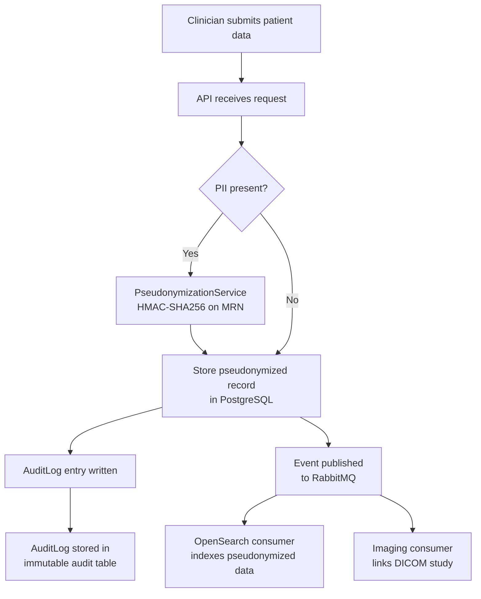

# Architecture Overview — Polaris Ophthalmic Data Registry

## System Overview

Polaris is a **federated, privacy-preserving** ophthalmic data registry. Each participating hospital operates an **autonomous node**: data never leaves the site in raw form. The central coordination layer (if any) only receives aggregate statistics or pseudonymized, research-approved exports.

## High-Level Architecture

```
┌──────────────────────────────────────────────────────────────────┐
│                        Hospital Node                              │
│                                                                   │
│  ┌─────────────┐    ┌──────────────────┐    ┌────────────────┐  │
│  │  Next.js 14 │───▶│  .NET Core 8 API │───▶│  PostgreSQL 16 │  │
│  │  (Frontend) │    │  (Backend)        │    │  (Primary DB)  │  │
│  └─────────────┘    └────────┬─────────┘    └────────────────┘  │
│                              │                                    │
│              ┌───────────────┼───────────────┐                   │
│              ▼               ▼               ▼                   │
│        ┌──────────┐  ┌────────────┐  ┌────────────┐            │
│        │  Redis 7 │  │ RabbitMQ + │  │  Hangfire  │            │
│        │  (Cache) │  │ MassTransit│  │  (Jobs)    │            │
│        └──────────┘  └────────────┘  └────────────┘            │
│                                                                   │
│        ┌──────────┐  ┌────────────┐  ┌────────────┐            │
│        │  MinIO   │  │  Orthanc   │  │ OpenSearch │            │
│        │ (Storage)│  │  (DICOM)   │  │  (Search)  │            │
│        └──────────┘  └────────────┘  └────────────┘            │
│                                                                   │
│                    Auth0 (External IdP)                           │
└──────────────────────────────────────────────────────────────────┘
```

## Component Descriptions

### Frontend — Next.js 14
- App Router with React Server Components for server-side rendering.
- Auth0 SDK (`@auth0/nextjs-auth0`) handles login, logout, and session management.
- React Query (`@tanstack/react-query`) for data fetching and cache invalidation.
- Tailwind CSS for styling; Zod + React Hook Form for validated forms.
- Proxies API calls to the backend via Next.js rewrites (`/api/backend/*`).

### Backend API — .NET Core 8
Follows **Clean Architecture** with four layers:

| Layer | Project | Responsibility |
|---|---|---|
| Domain | `OphthalmicRegistry.Domain` | Entities, repository interfaces, domain logic |
| Application | `OphthalmicRegistry.Application` | MediatR commands/queries, FluentValidation, `Result<T>` |
| Infrastructure | `OphthalmicRegistry.Infrastructure` | EF Core, Redis, MassTransit, Hangfire, MinIO client |
| API | `OphthalmicRegistry.API` | Controllers, middleware, DI composition root |

### Database — PostgreSQL 16
- Primary persistence for all clinical and administrative data.
- EF Core 8 with Npgsql provider; migrations managed via `dotnet ef`.
- Separate `hangfire` database for background job state.
- Extensions: `uuid-ossp` (UUID generation), `pg_trgm` (trigram search).

### Authentication — Auth0
- JWT Bearer tokens validated by the .NET API (`Microsoft.AspNetCore.Authentication.JwtBearer`).
- Role claims mapped to application roles: `SiteAdmin`, `Clinician`, `Researcher`, `SystemAdmin`.
- Frontend uses Auth0 Next.js SDK for session cookies; tokens forwarded to backend.

### Cache — Redis 7
- Distributed cache for frequently read data (site lists, user contexts).
- Session store for the frontend (optional).
- Rate-limiting counters.

### Message Broker — RabbitMQ + MassTransit
- Asynchronous event-driven communication between services.
- MassTransit abstracts transport; consumers are registered in the Application layer.
- Events: `ImagingStudyUploadedEvent`, `PatientRegisteredEvent`, `AuditEntryCreatedEvent`.

### DICOM Server — Orthanc
- Stores and serves DICOM imaging studies (OCT, fundus photography, FAF, etc.).
- Accessible via REST API from the backend.
- Mounted storage volume backed by the host filesystem or NAS.

### Object Storage — MinIO
- S3-compatible store for non-DICOM imaging files (JPEG fundus images, PDF reports).
- Backend uses `AWSSDK.S3` with a custom endpoint pointing to MinIO.
- Bucket: `imaging-studies`.

### Search — OpenSearch 2.x
- Full-text and structured search over clinical visit notes and imaging metadata.
- Index updated asynchronously via MassTransit consumers when records are created/updated.

### Background Jobs — Hangfire
- Scheduled tasks: nightly audit log archival, OpenSearch index sync, data quality checks.
- Dashboard available at `/hangfire` (restricted to `SystemAdmin` role in production).

## GDPR Data Flow



## Security Boundaries

### Pseudonymization
- All patient MRNs are transformed using HMAC-SHA256 with a site-specific key (`PSEUDONYMIZATION_HMAC_KEY`).
- The original MRN is **never stored** in the registry database.
- Re-identification requires the HMAC key, which is held only by the site's data custodian.

### Access Control
| Role | Permissions |
|---|---|
| `SystemAdmin` | Full access including Hangfire dashboard and site management |
| `SiteAdmin` | Manage users and patients within their own site |
| `Clinician` | Read/write clinical visits and imaging for their site's patients |
| `Researcher` | Read-only access to pseudonymized, approved data exports |

### Audit Logging
- Every `GET`, `POST`, `PUT`, `DELETE` on patient-related endpoints writes an `AuditLog` row.
- Audit logs are append-only; there is no `UPDATE` or `DELETE` path exposed to the application.
- Logs include: `UserId`, `Action`, `EntityType`, `EntityId`, `IpAddress`, `OccurredAt`.

## Deployment Model

Each hospital node is deployed using **Docker Compose** on a single server or small VM cluster within the hospital's network perimeter:

```
┌─ Hospital Network ──────────────────────────────┐
│  Docker Compose stack                            │
│  ├── frontend   (port 3000)                      │
│  ├── backend    (port 5000)                      │
│  ├── postgres   (port 5432, internal only)       │
│  ├── redis      (port 6379, internal only)       │
│  ├── rabbitmq   (ports 5672, 15672)              │
│  ├── minio      (ports 9000, 9001)               │
│  ├── orthanc    (ports 4242, 8042)               │
│  └── opensearch (port 9200, internal only)       │
└─────────────────────────────────────────────────┘
```

Only the frontend (3000) and backend (5000) ports are exposed to the hospital LAN. All other services communicate on the internal Docker network.

## Data Residency

- **All patient data remains within the hospital's Docker Compose network.**
- No data is replicated to a central server without explicit, audited consent.
- Inter-node federation (for multi-site research) is handled via approved, pseudonymized export jobs triggered by `SystemAdmin` users only.
